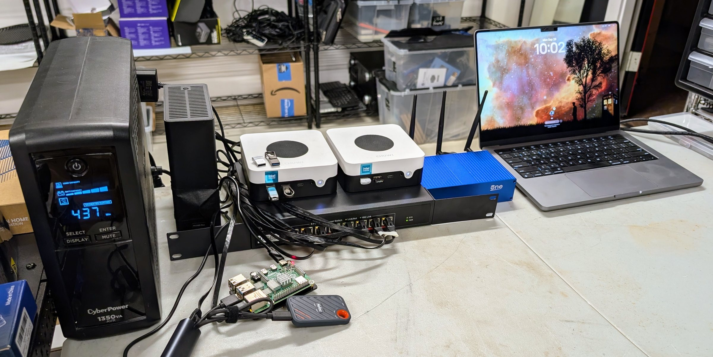

# The Seed

The Seed is the smallest version of [Node0](https://github.com/oznog-holdings/node0-public): a
self-hosted site for a person and their agents, built one box at a time. Each step up is a rung,
and every rung is a complete site for someone. This repository holds what you need to build your
own: what each rung gives you, the decisions behind it and the options we met, what it cost and
what we measured, the steps, and the bench's configuration as it ran.

It is for people starting small, from the laptop they already have, and for the agents they
point at these pages.

**Read it rendered: [oznog.com/node0/seed](https://oznog.com/node0/seed/).**

*The whole Seed on 20260928, rungs 1 to 4: the UPS, the infra box, the two mini PCs on the 10G
switch, the router, the core Pi with its SSD, and the compute laptop.*

## How it was built

An agent built it, from the public pages, on a bench of spare hardware, between 20260923 and
20260929. Keel, the building agent, did the work in its own repository. Rigger, the orchestrating
agent, set the tasks, reviewed the results and published them. Christoph made the decisions and
did everything that needed hands: cabling, power and logins. Everything here was run on that
bench; anything that was not says so where it appears.

## Where to start

There are two ways up. The full ladder below builds the whole site, one box at a time. The
shorter path, [laptop, agent, compute](another-way-up.md), skips rungs 1 and 3 and uses hosted
services in their place. It suits people who mainly want agents and private models. It is a
design: every piece has run on the bench, but not the path as a whole.

Read [the ladder on the Seed page](https://oznog.com/node0/seed/#the-ladder) first. Then pick
the rung you are on:

| Rung | You add | Folder |
|---|---|---|
| 0 | backups from the laptop you already have | [rungs/0-laptop](rungs/0-laptop/) |
| 1 | one infrastructure box: storage, DNS and time, HTTPS, a password manager, a forge, a model gateway, backups, monitoring, an agent VM | [rungs/1-infra](rungs/1-infra/) |
| 2 | the agent gets its own small box | [rungs/2-agent](rungs/2-agent/) |
| 3 | a core box that keeps names, time and alerts alive when infra is down | [rungs/3-core](rungs/3-core/) |
| 4 | a compute box for local models | [rungs/4-compute](rungs/4-compute/) |
| 4b | many kinds of models behind one gateway | [rungs/4b-models](rungs/4b-models/) |
| 5 | the router as the edge, three wifi networks, a second site | [rungs/5-edge](rungs/5-edge/) |
| 6 | a dedicated firewall, with the router as its access point | [rungs/6-firewall](rungs/6-firewall/) |

Stop wherever the site does what you need.

**The agents.** [Tender and Keel](agents/README.md): the site agent that watches and fixes the
Seed, and the building agent that built it, with how Tender was tested and what it still gets
wrong.

## Using these pages with an agent

The pages are written to be read by a person and used by their agent. Point an agent at this
repository and give it your situation. A prompt that works:

> Read the Seed page, then the rung READMEs up to the rung I name, and pitfalls.md. I have [the
> hardware on my bench], I need the site to [the workloads], and my limits are [budget, power,
> space]. Ask me what is missing, fill values.yaml from values.example.yaml with me, and cite the
> rung or pitfall behind each choice. Keep separate what the bench ran (as-built/), what the
> templates propose, and what you infer.

Three things are worth an agent's attention on every rung page. The **Status** line says what
was built and tested, and on what date. The **Decisions and options** section says what would
change a choice for your site. Every figure in [data/](data/README.md) carries the conditions it
was measured under, so an agent can compare your box to ours before it relies on a number.

## How each rung is written

Every rung folder has the same five parts:

1. **What you get.** The site as a whole at this rung, and what it still cannot do.
2. **Decisions and options.** Each choice we made, the alternatives we met, and what would
   change the choice for you.
3. **Costs and measurements.** What it cost and what we measured, with the conditions each
   figure was taken under.
4. **Runbooks.** The steps. Today each rung page lists its steps in order and links the bench's
   own procedures; full runbooks come from a fresh-agent build (below).
5. **Configuration.** Templates filled from one values file exist for a few pieces, listed in
   [templates/README.md](templates/README.md). For the rest, the rung page points to the
   bench's configuration as it ran.

## Files, and how to reuse them

| Path | What it is |
|---|---|
| [`rungs/`](rungs/) | One folder per rung, each in the five parts above |
| [`as-built/`](as-built/) | The bench's configuration, scripts and monitoring exactly as they ran, scrubbed only where they touched things outside the Seed |
| [`templates/`](templates/README.md) and [`values.example.yaml`](values.example.yaml) | The pieces you fill from one values file |
| [`data/`](data/README.md) | The measurements, each with its conditions |
| [`runbooks/`](runbooks/README.md) | Procedures that span rungs; the recovery pack so far |
| [`pitfalls.md`](pitfalls.md) | The traps we hit, each with what to do instead |
| [`costs.md`](costs.md) | What each rung costs to buy and to run |
| [`images/`](images/README.md) | Photographs and screenshots from the bench, with what each shows |
| [`agents/`](agents/README.md) | The two agents, Tender and Keel, and the test of Tender |
| [`another-way-up.md`](another-way-up.md) | The shorter path: laptop, agent, compute |
| [`decisions/`](decisions/README.md) | The choices across rungs; not yet written, since each rung page carries its own |

**Making it yours.** Copy [values.example.yaml](values.example.yaml) to `values.yaml` and change
it: your domain, your addresses, your names. The templates read from it. The example uses
documentation addresses (192.168.50.0/24, `site.example.com`), and the templates hold no real
address. [as-built/](as-built/) keeps the bench's own Seed networks (192.168.1.0/24, with guest
and IoT at 192.168.20.0/24 and 192.168.30.0/24) and shows its domain as `seed.example.com`.
Nothing in the repository is a serial, a device identifier or a secret.

## Status

Rungs 0 to 6 were built and tested on the bench by 20260929. The site agent, Tender, has run
the Seed since 20261006, after its test. The bench keeps double NAT, two
routers in a row that each translate addresses, by Christoph's decision; [rung 5](rungs/5-edge/)
says why and what it changes. Each rung page gives its own checks and figures. Sections not yet
written say so.

## What is coming

Built on the same bench, and added here once each passes its checks there:

- **The agents on a GPU.** Hermes on a local model, against Tender, on one GPU, with the same
  faults and the same grading.
- **Optional services, one guide each.** Home Assistant, Immich, Jellyfin and a media set,
  Paperless with Stirling, n8n, Sure with Fava, and a private Matrix server.
- **Runbooks from a fresh-agent build.** A fresh agent, given only this repository, rebuilds
  rungs 1 and 2, and its steps become the numbered runbooks.

## Before anything is published

Every change goes through three checks before it is pushed here. A second agent reads the pages
for clarity. The publication gate that guards [node0-public](https://github.com/oznog-holdings/node0-public)
scans the tree for addresses outside the Seed's own networks, keys, tokens, credentials and
image metadata, with private lists of names and patterns, and gitleaks scans for secrets as a
second gate. Then a separate reviewer reads the whole change for what the gate cannot see: a
label in a photograph, a secret someone encoded, a name that is not on a list. Exceptions to the gate live in [`.sanitize-allow`](.sanitize-allow),
each scoped to one rule with its reason. **A green gate is necessary, never sufficient.**

## Corrections, and things that should not be here

Found something wrong, unclear or broken, or got stuck building your own? Open an issue. Say
which rung or file, what you tried, on what hardware, and what happened. A place where the pages
were not enough for you and your agent is a gap we want to fix. [`CONTRIBUTING.md`](CONTRIBUTING.md)
has the detail, including why patches are read as suggestions: this repository is a mirror,
overwritten from its origin on every push.

Found something that should not have been published, an address, a credential, a name? Do not
open a public issue. Use [private vulnerability reporting](https://github.com/oznog-holdings/node0-seed/security/advisories/new)
or the contact in [oznog.com's security.txt](https://oznog.com/.well-known/security.txt).
[`SECURITY.md`](SECURITY.md) says what happens next.

## Licences and citation

Two licences, by directory; [`LICENSE`](LICENSE) at the root maps them.

| What | Licence | What it asks of you |
|---|---|---|
| The writing, data and images (the rung pages, the agents, runbooks, decisions, data, costs, pitfalls, photographs) | [CC BY 4.0](LICENSE-content) | Credit Oznog Holdings LLC, link the licence, and say what you changed |
| The configuration and code (`templates/`, `as-built/`, `values.example.yaml`) | [MIT](LICENSE-code) | Keep the copyright and permission notice |

To cite a rung: *Oznog Holdings LLC, "\<rung title\>", the Seed, \<page URL\>*; add the commit
permalink where precision matters, since the pages change as the bench does.

The Seed is built by Oznog Labs; the work is held by Oznog Holdings LLC. Forgejo is the origin
of this repository and GitHub is its mirror, synced on every push. Copyright Oznog Holdings LLC,
2026.
