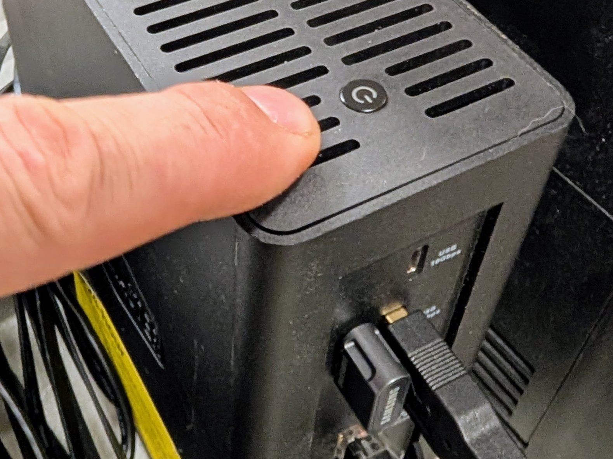
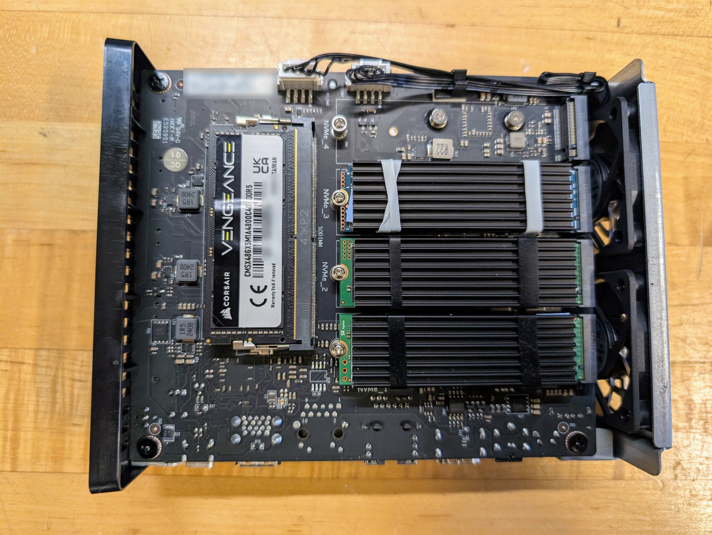
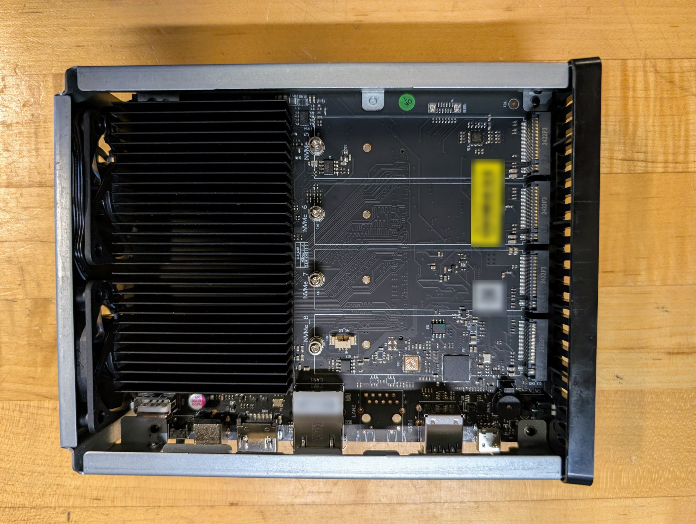

# Rung 1: the infrastructure box

**In plain terms.** One quiet box at home becomes the heart of your digital life. It keeps your
files safe, holds your passwords, runs your own private services, and lets an AI assistant work
for you while your laptop is closed. It shuts itself down safely in a power cut and tells your
phone when something needs attention. From here, everything else is an addition, never a
rebuild.

## What you get

One always-on box that runs the site:

- storage, as a ZFS pool with checksums and snapshots;
- DNS with your site's names, and a time server, for the whole house;
- HTTPS for every service with a publicly trusted certificate, though nothing is reachable
  from the internet;
- your own password manager (Vaultwarden);
- a forge (Forgejo) holding the site's configuration as the repository of record;
- a model gateway (LiteLLM) that meters what each agent and person spends;
- an inventory (NetBox);
- remote access from anywhere with Tailscale, with no open ports: the box is the subnet
  router, relaying your devices away from home to the home network;
- file sync with Syncthing: the documents share kept in step with your machines on the home
  network, with older versions of changed files kept;
- two scheduled backup flows and a weekly restore test;
- monitoring, alerts to your phone, and an external dead-man (a hosted check that alarms
  when expected pings stop) for when the whole box is down;
- a clean shutdown from the UPS in a power cut;
- an agent VM, where your agent works while you are away from the laptop.

**Buy.** A box that runs Unraid; the licence tier that covers every drive attached, assigned
or not; a 2.5G or 10G switch; two or three drives; one 1500 VA UPS on USB; cables. The bench ran
an all-flash box with eight M.2 slots and a 10 GbE port, which ships with 16 GB (ours was
upgraded to 48 GB), and a 1350 VA UPS. Other boxes that fit are under Decisions and options.

**What still fails.** The box is a single point of failure. When it is down, so are DNS,
the password manager (reads still work from each client's cached copy), the forge and your
agent. Rungs 2 and 3 take the agent and then names, time and alerts off it.

Stop here if one box that runs without you is what you need.

## Decisions and options

**Unraid, with ZFS pools and no parity array.** Every setting is in its web page, so a person
can run it without a shell, and it gives containers and VMs on one box.
*Would change it:* you already run TrueNAS or Proxmox well.

**The box: any x86 machine that boots Unraid from a USB stick.** It needs slots for the drive
count you will end at, a 2.5G or faster network port, and 16 GB of memory or room to add it.
The bench ran a TerraMaster F8 SSD Plus: all flash, eight M.2 slots, 10 GbE, quiet enough for
a living space. Other boxes that fit (models checked 20260928):
- **More space per dollar, on hard drives:** UGREEN's DXP line (the DXP4800 Plus has 10 GbE)
  or TerraMaster's F4-424 Pro. Hard drives cost less per terabyte than flash, and are louder,
  warmer and draw more power.
- **ECC memory:** Asustor's Lockerstor 4 Gen3, which ships with 8 GB of ECC. ZFS checksums
  what is on the drives; ECC protects the data while it is in memory.
- **QNAP:** its x86 models can boot Unraid from a USB stick, but check your model first.
- **Going large:** 45Drives' 45HomeLab HL8 or HL15, including a series built with Unraid's
  makers for Unraid.

A vendor's warranty may not cover a box running another operating system; check before you
install.

- **raidz1 over three drives** gives about two drives of space and survives one failure.
  Choose the layout for the drive count you will end at: two drives a mirror, three or four
  raidz1, five or more raidz2. A raidz group can grow one drive at a time but never changes
  its parity level. A mirror becomes raidz only by rebuilding the pool from backup. A second
  mirror or group can always be added beside the first; Node0's full-size pool is three
  groups of ten drives side by side.

- **Mixed drive sizes.** A raidz group counts every member at the smallest drive's size, so
  a larger drive added later adds only that much. Either accept it and replace the small
  drives later, or put the larger drive in its own mirror or pool.
- **Turn on array auto start** as soon as the pool exists (Settings, Disk Settings). It is
  off by default, and without it nothing on the pool comes back after a reboot or a power
  cut. On the bench on 20260924 that left the whole site down for 12 minutes, until someone
  started the array by hand (see [pitfalls](../../pitfalls.md#after-a-reboot-the-whole-site-stayed-down-rung-1)). Reboot once on purpose and
  check the site returns with nobody touching it.
- **Burn in by filling, not by scrubbing an empty pool.** A scrub reads only what has been
  written. Fill to about 80% with random data
  ([burnin-fill.sh](../../as-built/tools/burnin-fill.sh) writes incompressible 1 GiB files),
  scrub, compare the drives' SMART counters with a reading taken before the fill, then
  delete the fill. For NVMe, compare `media_errors`, `critical_warning` and
  `available_spare`. A new media error, any warning, or a drop in spare sends the drive back.
- **On the reference box, turn VT-d off in the firmware.** With it on, Unraid can panic at
  boot, more so with more memory installed; on the bench it did with 48 GB.

**Memory: run the stock 16 GB through rungs 1 and 2.** Buy memory when a workload asks for it,
and on that day buy 32 GB, unless 48 GB costs less than 1.5 times as much (on 20260921 it did
not). After adding memory, raise the ZFS cache ceiling (`zfs_arc_max` in
`/boot/config/modprobe.d/zfs.conf` on the flash) and reboot, because Unraid sets the ceiling
once, at first boot, and never recalculates it.

**Static addresses for servers, set where each is installed** (the Unraid USB Creator, the
NixOS flake, the Mac's settings), outside the router's DHCP pool, so no server's address
depends on the router. Each of those places already asks for one. Laptops and phones stay on
DHCP.

**DNS: AdGuard Home, built from a list of names in the repository.** Adding a name is one
line and a deploy. AdGuard's start script copies the settings rendered from the repository
over its own at every start, so a change made in AdGuard's web page lasts only until the
next restart ([start.sh](../../as-built/site/dns/adguard-archive/infra/start.sh), archived since the bench moved DNS to Technitium at [rung 5](../5-edge/);
[check-dns](../../as-built/site/bin/check-dns) reports the drift before then).
- Filtering stays on for every client, because a client with filtering off also loses your
  own names (see [pitfalls](../../pitfalls.md#exempting-a-client-from-ad-filtering-also-removes-your-own-names-rung-1)).
- The router hands out your DNS server by DHCP **and** stops announcing itself over IPv6
  (on OpenWrt, `dhcp.lan.dns_service=0`). Otherwise IPv6 clients ask the router for some
  names and skip your server.

**Time: chrony in a container, serving the house.** Turn off Unraid's own NTP (Settings, Date
and Time, "Use NTP") so chrony can hold UDP port 123 and keep the box's clock. Saving that
form set our clock back a few seconds, and chrony's first step corrected it (see
[pitfalls](../../pitfalls.md#switching-unraids-clock-to-manual-moved-it-back-rung-1)).

**HTTPS: Caddy, with one wildcard certificate by DNS-01.** It needs a DNS provider whose API
token can be limited to your one domain. Set a short challenge TTL (`dns_ttl 60s`), and test
against staging once before production. With the provider's default TTL, a staging run
blocked the real certificate for an hour (see
[pitfalls](../../pitfalls.md#a-test-certificate-blocked-the-real-one-for-an-hour-rung-1)).

**The password manager: Vaultwarden on infra, a hosted Bitwarden for break-glass.**
"Break-glass" means kept for emergencies only, like the key behind glass on a fire alarm. Your own
server gives each agent its own scoped access, one collection per identity, so every read is
attributed. Copy routine secrets across first, prove the backup and a restore, and only then
remove them from the hosted one. The hosted one keeps the break-glass set: whatever you need
to recover the box Vaultwarden runs on, including the keys to Vaultwarden's own backup.
*Would change it:* you are happy with a hosted password manager alone. Then skip Vaultwarden;
nothing else depends on it.

**The forge: Forgejo, long-term-support release, private by default.** Sign-in required,
registration off, git over ssh on its own port. Its backup is Forgejo's own dump plus a git
bundle checked with `git fsck` after a restore on another machine.

**The model gateway: LiteLLM, with a shared Postgres.** One key per agent or person, each
limited to the models it may use. It exists from this rung because it meters hosted spend,
and every later model backend is one more entry behind it.

**Remote access: Tailscale, with infra as the subnet router.** Install Tailscale's Unraid
plugin, advertise the site's range in its settings (Settings, Tailscale), and approve the
route in Tailscale's admin page. Laptops accept routes. Hosts inside the site never do, or
they prefer the tunnel to the LAN beside them. No port forwards.
*Would change it:* a business with many users; the per-user price may push you to host the
control server yourself (Headscale).

**File sync: Syncthing on infra, with staggered versioning.** It keeps the documents share in
step with your laptops on the home network only (global discovery, relays and NAT traversal
off), and keeps older versions of changed files. Its web page listens on the box itself and
is reached through the proxy, with its own login
([my-syncthing.xml](../../as-built/site/infra/templates/my-syncthing.xml)). Never pass a
secret through a synced folder: a stray key reaches every device within minutes.

**NetBox for the inventory**, filled by a small sync from the repository's hosts file, with a
check that reports any difference.
*Would change it:* a small site can keep the hosts file alone.

**Backups, two flows that stay apart:**
1. **The site's own data** goes nightly with Backrest and restic to the bucket from rung 0,
   with its writer key. It covers the applications' dumps, made just before the run; the app
   data, except live databases and repositories, which the dumps cover; the Unraid flash;
   host keys; and documents, finance and photos. A start hook refuses to run if the dumps
   are more than 26 hours old or a source is empty
   ([config.jq](../../as-built/site/infra/backrest/config.jq),
   [seed-dumps.sh](../../as-built/site/infra/backup/seed-dumps.sh)).
2. **The machines** (laptop, agent box) back up every two hours to a restic rest-server on
   infra running **append-only**, one repository per machine, so a compromised machine
   cannot delete its own history. Clean-up (forget and prune) runs only on the server. After
   the clean-up, rclone copies the server's directory to a second bucket from a ZFS
   snapshot. It runs **without** `--b2-hard-delete`, so the 30-day rule also protects the
   mirror
   ([rest-maint.sh](../../as-built/site/infra/backup/rest-maint.sh)).

A weekly job checks that each repository is fresh, runs
`restic check --read-data-subset=N/26` with N stepping from 1 to 26 across the weeks, and
restores up to three small files from each, compared by hash
([weekly-verify.sh](../../as-built/site/infra/backup/weekly-verify.sh)).

**Monitoring: Prometheus, Alertmanager, node_exporter and the blackbox exporter,** on
localhost only, behind the proxy with a password. Every rule tests an age, a growth or the
latest run's state. None fires on a logged error, because a job that has stopped running
logs no errors. Each rule has a unit test that runs before every deploy. Alerts go to ntfy,
a push service with a phone app.
- **An external dead-man (Healthchecks.io).** Alertmanager's always-firing Watchdog pings
  it; if the pings stop, it emails you. It is the only thing that can tell you the whole box
  is down. When the array stayed stopped on 20260924 (above), the dead-man was the only
  alarm. With infra fully down, its email arrives in
  about 6 min ([data](../../data/README.md#alert-timing)).

**The agent VM: NixOS, 4 GiB to start, static address, with `/work` on its own disk.** The
agent tools are pinned in its configuration, because they release faster than the NixOS
channels. Account connectors (mail, documents) are switched off for every agent.

**UPS: Unraid's built-in support**, shutting down at 25% battery or 10 minutes left,
whichever comes first. The UPS is never told to cut its own output (`KILLUPS no`).
- **Set the box to power on by itself when power returns** (a firmware setting, often called
  "restore on AC power loss"). Ours did: with the box shut down and its power cut and
  restored, it started, started its array and had every service answering 1 min 39 s after
  power returned, with nobody touching it ([data](../../data/README.md#recovery-times)).
- **After a UPS shutdown, the box stays off when mains returns.** The UPS kept its output
  on, so the box never lost power, and that firmware setting has nothing to act on. A person
  has to cycle its power or press its button after every UPS shutdown. From there every
  service answered in about 1.5 min ([data](../../data/README.md#power-ups-test-rung-1)).
- **Make the power alert faster than the shutdown.** On 20260927 the box began shutting down
  42 seconds after the cut, before the one-minute poll that reads the UPS had run, so no "on
  battery" alert went out. Read the UPS state every 15 seconds, and treat any status other
  than mains as a power event.
- **Set the shutdown threshold by runtime when you test it.** The charge reading sags as
  soon as the UPS takes the load. Ours fell from 100% to 79% in 40 seconds, so a high charge
  threshold shuts the box down at once
  (see [pitfalls](../../pitfalls.md#shortening-a-ups-test-with-a-high-charge-threshold-trips-at-once-rung-1)).

**A recovery pack, rehearsed on other hardware.** One encrypted file holds everything needed
to rebuild the site; its full contents are listed in
[the recovery pack runbook](../../runbooks/recovery-pack.md#what-goes-in-it). Keep two copies: one
fully off site, one on site in a separate place such as another room or a fireproof safe.
Rehearse with the infra box off. On 20260928 we rebuilt the infra box on a spare mini PC from
the pack alone. Restore only what moves to new hardware, never the old array's record
(`super.dat`).
- **Decide how a new Unraid stick will be licensed before you need it.** Unraid refused a
  trial on a stick holding a restored installation, and a paid licence moved to a new stick
  retires the old stick for good. The steps are in
  [the rehearsal's record](../../runbooks/recovery-pack.md#the-whole-infra-box-on-other-hardware-20260928).

## Costs and measurements

**Memory.** Measured with everything above running, at rest, 30 minutes or more after boot.

| Host memory | Agent VM | Host available | ZFS cache | Host memory the VM holds |
|---|---|---|---|---|
| 16 GB (emulated, see [data](../../data/README.md#memory-rung-1)) | 4 GiB | 5.5 GB | 2.1 GiB | not recorded |
| 48 GB | 4 GiB | 42.2 GB | 0.85 GiB (cold) | 1.14 GiB |
| 48 GB | 8 GiB | 41.3 GB | 2.5 GiB | 1.15 GiB |
| 48 GB | 16 GiB | 41.2 GB | 2.5 GiB | 1.26 GiB |

- Unraid plus everything on this rung costs a steady 3.7 to 3.9 GiB, at every size.
- A VM's size costs nothing until the guest uses it. An idle 16 GiB VM took 1.3 GiB of host
  memory, and the host keeps what the guest has touched.
- Budget, by arithmetic from these figures: 3.9 GiB, plus the ZFS cache ceiling, plus about
  1.1 times the VM's allocation, because a VM that had worked for hours held 4.34 GiB of a
  4 GiB allocation. On a 16 GB box the VM can have at most about 4 GiB.
- The ceiling Unraid sets at first boot is 20% of the memory installed then (see
  [pitfalls](../../pitfalls.md#adding-memory-did-not-grow-the-zfs-cache-rung-1)).
- Still to measure: a working day with the agent busy in the VM; a warm cache after a
  nightly cycle; the cache under a scrub.

**Burn-in.** Three 512 GB NVMe drives in raidz1, filled with 790 GB of random data (80% of
usable), scrubbed in 11 minutes 18 seconds with 0 errors and no SMART changes.

**Costs.** Estimated from the Seed's design prices (US, checked 20260920; [costs](../../costs.md)): $1,580 for the lean
version of this rung, $2,580 full and $3,430 with 48 GB of memory bought up front, for
everything under Buy. The bench ran on spare hardware, so these are not what we paid. The
recurring floor is about $22 a year for the domain and one DNS zone, on a DNS plan without the
domain-scoped tokens the certificate job wants; a plan with them costs more.

## Runbooks

The rung's runbook is not yet written as numbered steps. These are its parts, in the order
they are done, with what the repository has for each so far. Linked files are the bench's
own, with the bench's names and addresses; read them as worked examples.

1. Install Unraid (static address, UEFI), and start the trial.
2. Create the pool through the UI, turn array auto start on, and burn in with
   [burnin-fill.sh](../../as-built/tools/burnin-fill.sh).
3. Set Docker to use a directory on the pool instead of an image file. An image file fills
   up from the containers' writable layers, and then one container takes the rest down.
4. DNS and time, then have the router hand out your DNS and stop announcing its own. The
   traps are in [pitfalls](../../pitfalls.md#dns-moved-off-the-router-except-over-ipv6-rung-1) and the
   entries after it.
5. The proxy and the wildcard certificate.
6. Vaultwarden: copy, back up, restore, then trim the hosted vault to the break-glass set.
   What the break-glass set holds is in
   [pitfalls](../../pitfalls.md#a-self-hosted-password-manager-holding-the-keys-to-its-own-backup-rung-1), and the off-site copy
   is [the recovery pack](../../runbooks/recovery-pack.md).
7. The forge, and its backup restored on another machine with
   [forgejo-backup.sh](../../as-built/site/infra/backup/forgejo-backup.sh).
8. The gateway and NetBox.
9. Remote access and file sync: Tailscale with infra's route approved, then Syncthing for the
   documents share.
10. The two backup flows and the weekly restore test, with the scripts in
   [as-built/site/infra/backup/](../../as-built/site/infra/backup/).
11. UPS shutdown, tested once by cutting the UPS input. The bench's test plan is
    [ups-power-test.md](../../as-built/site/runbooks/ups-power-test.md), and its results are
    in [data](../../data/README.md#power-ups-test-rung-1).
12. Monitoring: producers first, then rules, then the dead-man. Cause each alarm once.
13. The agent VM.
14. Reboot on purpose, and run the post-reboot check,
    [check-after-reboot](../../as-built/site/bin/check-after-reboot). It checks the array,
    the pool, every container, the VMs and each service, and exits 1 on any failure.

## Configuration

In [templates/](../../templates/), filled from your values file: the Caddyfile, the DNS names
list, infra's chrony configuration, and the monitoring floor's rules with their unit tests
and the metrics producer.

Not yet templated, so see the bench's versions: AdGuard's settings, archived at rung 5
([as-built/site/dns/adguard-archive/](../../as-built/site/dns/adguard-archive/)), the backup scripts
([as-built/site/infra/backup/](../../as-built/site/infra/backup/)) and Backrest's
configuration ([config.jq](../../as-built/site/infra/backrest/config.jq)), the rest of the
monitoring ([as-built/site/infra/monitoring/](../../as-built/site/infra/monitoring/)),
LiteLLM's configuration ([config.yaml](../../as-built/site/infra/litellm/config.yaml)) and
the post-reboot check ([check-after-reboot](../../as-built/site/bin/check-after-reboot)).
