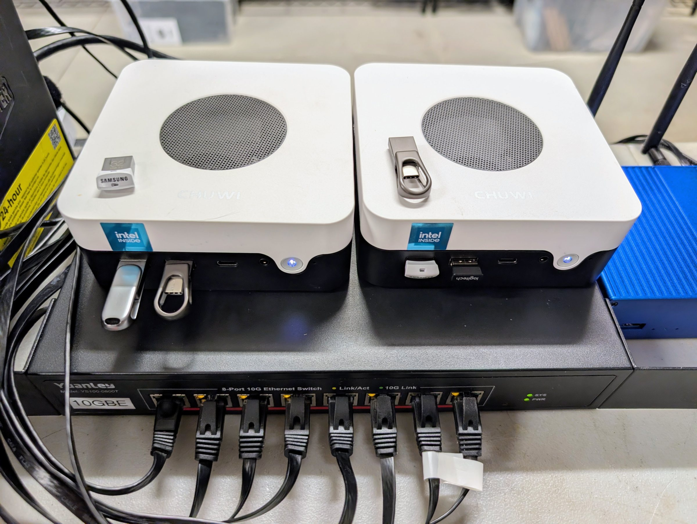

# Rung 2: the agent gets its own box

**In plain terms.** Your AI assistant moves to a small box of its own. That box stays up while
the main box is being updated or has a problem, though the assistant's models and the services
on the main box wait until it is back. The box repairs itself after a bad update, and you can
reach your home services from anywhere. This is the step that makes an assistant dependable
enough to leave running.

## What you get

The agent runs on its own box, so the box stays up while infra is maintained, rebooted or
down, and its builds no longer share infra's memory. While infra is down, whatever the agent
reaches through infra stops: model calls through the gateway, the forge, the password manager
and every other service on infra.

- **The box configures itself from the forge**, and a deploy that breaks it rolls back with
  no one at the box.
- Secrets are encrypted in the repository to three keys: the box's own, the laptop's, and
  an offline master key kept only in the password manager for emergencies (break-glass).
- The agent account is unprivileged, allowed to start only the box's own named jobs.
- **A watcher** notifies you when something on the site stops answering.
- Infra and this box are both configured as subnet routers on your tailnet (your Tailscale
  network): each relays traffic from your devices away from home to the home network. On the
  bench this box carried the route; infra's stayed a standby, configured but not yet tested,
  so remote access with this box down is not proven.
- Backups of the agent's work every two hours, to infra's append-only backup server.

**Buy.** One small always-on x86 box: an N100-class mini PC for agents only, or an
eight-core mini PC with two NVMe slots if it is also the development box (sized under
Decisions and options).

**What still fails.** Names, time and the main monitoring still run on infra; with infra down,
the agent box stays up and its watcher still reports, but the house loses DNS and the agent
loses its models. [Rung 3](../3-core/) moves names, time and notifications off infra; model
calls through infra's gateway still stop.

**The agents that live here.** Keel, the building agent, moved onto this box from a VM on
infra (runbook 4 below). Tender, the site agent, runs here too, in its own account. From this
rung it can watch the site and report, and from [rung 4b](../4b-models/) it has the utility
models its redaction needs. [The agents](../../agents/) page covers both.

Stop here if your agent is the main thing you run, and a few minutes of DNS outage when infra
restarts is fine.

## Decisions and options

**A small x86 box with a fast drive, sized for what the agent will do.**
- **For agents only.** An N100-class mini PC with 12 to 16 GB and a 2.5 GbE port. Agents that
  call models through the gateway need little memory of their own.
- **For agents and development.** 8 cores, 32 to 64 GB and two NVMe slots, so builds, test
  VMs and several worktrees fit beside the agents.

Ours is the first kind: a Chuwi LarkBox X (Intel N100, 12 GB soldered, 11.7 GiB usable), on its
2.5 GbE port. Ours has 12 GB, the low end of the range above; for a box that only runs agents
that was enough. Over 4.2 days of monitoring (20260924 to 20260928), available memory never fell
below 8.1 GiB, swap peaked at 24 MiB, memory pressure at 0.4%, and nothing was killed for lack
of memory.
- **Two boxes of the same model shipped with different storage.** One had a SATA SSD, the
  other NVMe. Check which yours has before planning the disk layout.
- **A firmware fault on our unit.** Saving any firmware setting left it unable to boot until a
  CMOS battery reset, which also erased the settings. So it cannot keep "power on after AC
  loss", and it stays off after a power cut. While powered it was stable through two hours of
  full CPU and memory stress, three warm restarts, and a 16 GiB write and read-back test. We
  run it on the UPS and never cut its power. If your box shows this, ask the maker for a
  batch-specific firmware; none is published.
  *Would change it:* a box that keeps its firmware settings.

**Installed over ssh, with no hands after the first boot.**
- The first NixOS install uses the stock installer, which logs in at its console and
  already runs ssh. At that console, put the agent's public key in `~/.ssh/authorized_keys`:
  `mkdir -p .ssh; chmod 700 .ssh`, `echo '<public key>' > .ssh/authorized_keys`,
  `chmod 600 .ssh/authorized_keys`. These are the three lines typed for the rung 1 VM on
  20260923; the lines typed on the rung 2 box itself were not recorded. Then the agent
  installs over ssh from the flake.
- After that, the agent builds a keyed installer image, writes it to the box's own USB stick
  (found by serial), sets a one-time boot to it, and reinstalls with no one at the box. The
  one-time boot worked on our box, so we never needed the fallback of kexec (starting the
  installer's kernel from the running system).
- **Check the firmware's boot entries after an install.** Ours still pointed at the old,
  wiped boot partition, so the next reboot would have started the installer again. Add an
  entry for the new partition and put it first.

**The disk layout keeps `/work` separate.** 1 GiB boot, 100 GiB root, the rest as a partition
for `/work`, declared in the flake with disko (NixOS's declarative disk layout) but without a
filesystem, so no install or reinstall can format it. Its XFS filesystem is made once by hand. A reinstall formats boot and root and
leaves `/work` alone.
- Pin the work volume's UUID, and keep the agent's logins, keys and state on it through bind
  mounts, so a rebuild needs no new logins.
- On a box with two NVMe slots, the second drive is the work volume, mounted before the first
  repository is cloned. On a one-drive box, as ours is, a partition does the job.

**The box resolves names without infra.** It carries the site's few addresses in its own hosts
file, from the repository, so it never depends on the thing it is watching.

**Pull-deploy from the forge.** The box pulls the `deploy` branch every 15 minutes with a
read-only deploy key and a pinned forge host key. Promotion to `deploy` is by merge only,
after a required build check has built every host.
*Would change it:* push-based deploys from a workstation are fine for one person with one
box. Use pull-deploy once agents change the configuration, so every change reaches the box
through a merge and the build check.

**Secret handling with sops-nix and three age recipients.** sops-nix decrypts the
repository's secrets on the box at activation; age is the encryption, and each recipient is
a key that can decrypt. The box decrypts with its own ssh host key, so keep a copy of that
key off the box. The offline master key can decrypt everything too, which is what lets you
re-encrypt the secrets to a new set of keys
([secrets-rekey.sh](../../as-built/tools/secrets-rekey.sh)).

**A bad deploy rolls back with no one at the box.** A box that loses its network after a deploy
cannot fetch the fix. NixOS keeps older generations in the boot menu, but choosing one needs
someone at the console. The three pieces below remove that step. On 20260928 we deployed a
generation with no network on purpose, and the box was back on the last good generation
22.5 min later, after 3 tries of about 7 min 20 s each
([data](../../data/README.md#recovery-times)).
- **Boot counting** (systemd-boot's automatic boot assessment). A new generation gets 3
  tries and is marked good only when a check after boot proves the network, ssh, the forge
  and `/work`. A generation that never passes gives way to the last good one by itself.
  The loader counts tries only against its `preferred` entry, and NixOS writes only
  `default`. So write `preferred` for the new generation, and point `default` at the last
  generation that booted and was marked good
  ([boot-assessment.nix](../../as-built/nixos/modules/boot-assessment.nix) does both).
- **A fixed rescue entry.** A small system that runs from memory, installed on the boot
  partition independently of every deploy, with a known network address and ssh. It boots
  to ssh in 27 s ([rescue-entry.nix](../../as-built/nixos/modules/rescue-entry.nix); the
  tests are in [rescue-boot.md](../../as-built/site/runbooks/rescue-boot.md)).
- **The hardware watchdog**, with panics on boot failure and no emergency shell, so a hung
  boot becomes a reset and counts as a try.

**The watcher is one scheduled script.** It checks DNS, the backups and the web front door,
and sends one line when any of them fails. Beyond the agent, the box carries only the watcher
and its Tailscale subnet router.
- **It probes more than the front page.** It also asks Unraid's own web page on port 80,
  which answers even when the array is stopped, so its message tells "infra is up but its
  services are not" apart from "infra is gone". Every network check has a timeout, and a
  run can never outlive its cycle.

## Costs and measurements

- The box: about $240 for an N100 box (ours sells for $234.88), or about $960 for an
  eight-core Ryzen mini PC with 64 GB and a second NVMe: a Minisforum UM890 Pro (Ryzen 9
  8945HS, 64 GB, 1 TB) was about $800 and a second 1 TB NVMe $150 to $320, checked 20260928
  ([costs](../../costs.md)). Ours was spare hardware.
- Power: its sibling of the same model drew 5.9 W idle on a plug meter. Ours has no meter of
  its own; by subtraction from the UPS input it draws at most about 16 W at rest
  ([data](../../data/README.md#power-draw)).
- A warm restart takes 27 to 33 seconds back to ssh
  ([data](../../data/README.md#recovery-times)).
- A rebuild from the forge, keeping `/work`, takes about 4 minutes from restart to
  answering. On 20260927 it took 12 min 13 s, 8 of them spent waiting with the box on the
  wrong network port, and the work volume came through untouched
  ([data](../../data/README.md#recovery-times)).

## Runbooks

Not yet written as numbered steps for your site. The bench's own runbooks exist for each
part, with the bench's names and addresses; read them as worked examples.

1. First install over ssh:
   [rung2-agent-install.md](../../as-built/site/runbooks/rung2-agent-install.md) (the plan
   as written before the install; it covers the keyed installer and the one-time boot).
2. The no-hands reinstall that keeps `/work`:
   [rebuild-agent-box.md](../../as-built/site/runbooks/rebuild-agent-box.md).
3. Pull-deploy, and promoting a change through the build check:
   [promote.md](../../as-built/site/runbooks/promote.md).
4. Moving the agent (its tools, logins, keys and work) from the VM to the box:
   [move-builder-to-agent.md](../../as-built/site/runbooks/move-builder-to-agent.md).
5. Testing the rollback and the rescue entry:
   [rescue-boot.md](../../as-built/site/runbooks/rescue-boot.md).

## Configuration

Not yet templated. The bench's flake is in [as-built/nixos/](../../as-built/nixos/): the
agent host and its disk layout (`hosts/agent/default.nix`, `hosts/agent/disko.nix`), and the
pull-deploy, watcher, agent-tools, boot-assessment and rescue-entry modules in `modules/`.
The sops configuration is not in the repository; the encrypted secret files were left out
at export.
