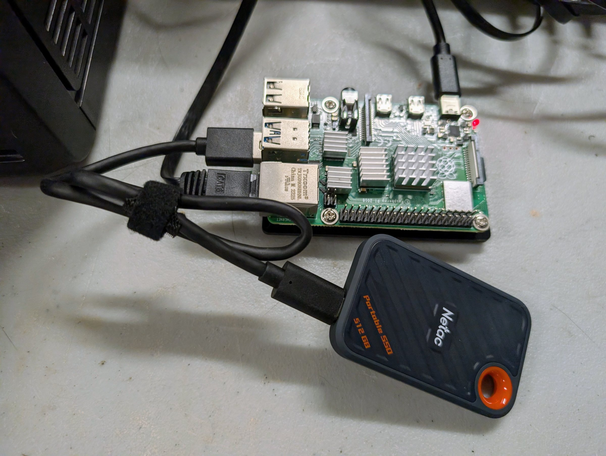
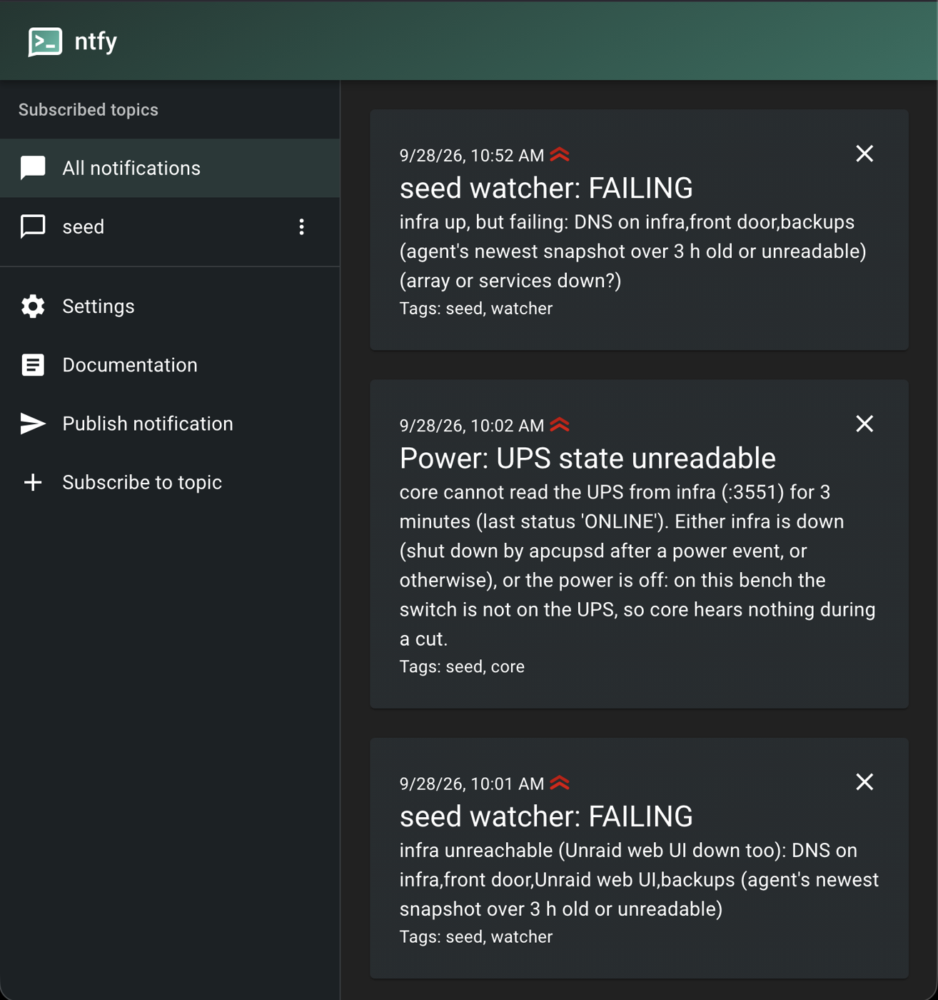

# Rung 3: the core box

**In plain terms.** A tiny, cheap box takes over the jobs the whole house depends on: finding
your services by name, keeping every clock right, and sending alerts. If the main box goes down,
the house keeps working and you are told. After this rung, the main box can fail without
taking the house down with it.

## What you get

A small, cheap, always-on box that keeps the house's names, time and alerts alive when the
infrastructure box is down:

- **DNS.** The router's DHCP hands out core as the first DNS server and infra as the second.
  Both serve the same list of names from the repository, so either can answer alone. The
  small box that never reboots is the primary, because resolvers try servers in order and a
  primary that is rebooting hangs every client.
- **Time.** Core takes time from the public pool first and infra second; infra takes it from
  the public pool only, so the two never time each other in a loop. With the internet's
  time servers blocked for three hours, the house stayed within a few milliseconds (core
  +1.3 ms when the block lifted; [data](../../data/README.md#time-rung-3)).
- **Notifications.** Alerts go to an ntfy server on core. Alerts about core itself go to a
  hosted topic, so the box that is down is never the one that has to tell you. With core
  powered off, its alarm reached the hosted topic in 5 min 7 s (table below).
- **A weekly restore rehearsal.** Core reads the offsite bucket, a different box from the one
  that wrote the backups, and restores into memory with `--verify`.
- **The home-automation hub**, if the home is part of the site, because it is needed most
  when infra is down.
- **It configures itself from the forge**, like the agent box. A failed fetch exits non-zero
  and applies nothing; it never falls back to a cached tree.

**Buy.** A second N100-class mini PC, about $240. It is the same architecture as the agent
box, so it is the same build with a different role list. A Raspberry Pi 4 on an SSD also works,
and the bench's core is one, though a kitted Pi now costs as much as an N100.

**What still fails.** The password manager, the forge and the model gateway still live on
infra. With infra down you keep names, time, alerts and the agent box, but you cannot change
the site's configuration. The switch, the consumer router, the UPS and every application on
infra are still single, which is what the second site and the backups exist for.

Stop here if losing the infra box should cost you a notification and a pause in its
applications, but never the house's names, time and alerts.

After this rung the ladder stops ordering by failure mode. [Rung 4](../4-compute/) and
[rung 5](../5-edge/) are independent branches: a site can take the edge before compute, the
second site before either, or neither for a long time. [Rung 6](../6-firewall/) follows rung 5.

## Decisions and options

**A Raspberry Pi 4 (4 GB) on Debian, for now.** The Seed's design recommends a small x86 box
running NixOS, which would share the agent box's configuration. We used a Pi because the
second x86 box could not keep its firmware settings. On Debian, a small deploy script keeps
the rule that the box is configured from the repository. It pulls a tree of files and a list
of pinned packages from the forge.
*Would change it:* a second small x86 box that behaves. Then use NixOS and the same flake.

- **A Pi has no real-time clock.** After a cold start with no internet its clock is a guess,
  and a time server told to serve its own clock would hand that guess to the house. Serve the
  local clock only after core has synchronised once since it started
  (`local stratum 10 orphan activate 0.1`), with infra, which has a clock, as a source. Or use
  a Pi with a clock (a Pi 5 with its battery, or a clock HAT).
- **On core, mark the public pool `prefer`.** Without it chrony can pick infra, and the
  primary then takes its time from the secondary.
- **SD cards wear out under always-on writes.** As built on 20260928, core boots from a USB
  SSD, and the SD card stays untouched as the way back. A portable SSD on a Pi 4 may drop
  off under load with the fast UAS driver. Adding
  `usb-storage.quirks=<vendor>:<product>:u` to the kernel command line turns UAS off for
  that drive and fixes it. The two IDs come from `lsusb` (see [pitfalls](../../pitfalls.md)).

**ntfy on core with its own certificate,** refusing anyone not logged in, one account per
subscriber. The hosted topic stays as the fallback for alerts about core.

**The restore rehearsal reads with a key that can only read.** A job that only restores
should not be able to write or delete, so give it its own list-and-read key for the bucket.

**Nothing else runs on core.** It is the box that handles power events, so no other job may
be able to take it down during one.

**Power: core rides the UPS and never shuts itself down.** A Pi that halts cannot start again
while the UPS keeps its power on; a Pi that loses power starts by itself when the power
returns. Core reads the UPS state from infra and reports it, and keeps running. Infra drives
the UPS and serves its state to the network (apcupsd's network server), and shuts itself down
cleanly on low battery.

## Costs and measurements

Figures from [data](../../data/README.md), with the conditions each was taken under.

| What | Figure | Conditions |
|---|---|---|
| Power | 3.7 to 3.8 W | at rest, on a USB SSD, from a metered smart plug (20260928) |
| Cold start to ssh | 32 s | Debian, SD card (20260924, before the move to the SSD) |
| Cold start to serving correct time | 45 s after power; 10 s after its first sync | chrony, no real-time clock, pool preferred (20260924) |
| A cold start 9 hours behind | corrected by 32,534 s in one step, 22 s after boot | it never served the wrong time as good |
| Core powered off, to its alarm on the hosted topic | 5 min 7 s | the watcher on the agent box; Alertmanager followed 1 min later |
| Core's ntfy blocked for 2 minutes | alert delivered 46 s after the block lifted | Alertmanager retries; nothing lost |

**Costs.** Estimated from the Seed's design prices (US, checked 20260920; [costs](../../costs.md)): $240 for this rung (the
N100 price rechecked 20260928); through rung 3, $2,060 lean and $3,780 full. The price of the bench's Pi
and its SSD is not yet recorded.

## Runbooks

Not yet written as runbooks. Until they are, the bench's own versions are in
[as-built](../../as-built/site/core/):
1. Core's first setup: static address, the Seed's keys, the deploy script. As built: the
   bootstrap in [`as-built/site/core/README.md`](../../as-built/site/core/README.md).
2. Moving DNS and time primaries to core, and checking both servers serve the same names. Not
   yet written.
3. ntfy with the hosted fallback, and proving the fallback by stopping ntfy. Not yet written.
4. The weekly restore rehearsal. As built:
   [`seed-restore-rehearsal`](../../as-built/site/core/files/usr/local/sbin/seed-restore-rehearsal).
5. The power protocol. As built:
   [`power-protocol.md`](../../as-built/site/runbooks/power-protocol.md).
6. The move from the SD card to a USB SSD. As built:
   [`ssd/README.md`](../../as-built/site/core/ssd/README.md).

## Configuration

In [templates/](../../templates/), filled from your values file: core's chrony configuration
and the DNS names list, which core serves as well as infra. The rest is not yet templated. As
built: core's file tree (chrony, nftables, the systemd
units and their scripts) in [`files/`](../../as-built/site/core/files/), the deploy script
[`seed-deploy`](../../as-built/site/core/seed-deploy), [`apply`](../../as-built/site/core/apply),
and the pinned package list [`pins`](../../as-built/site/core/pins).
