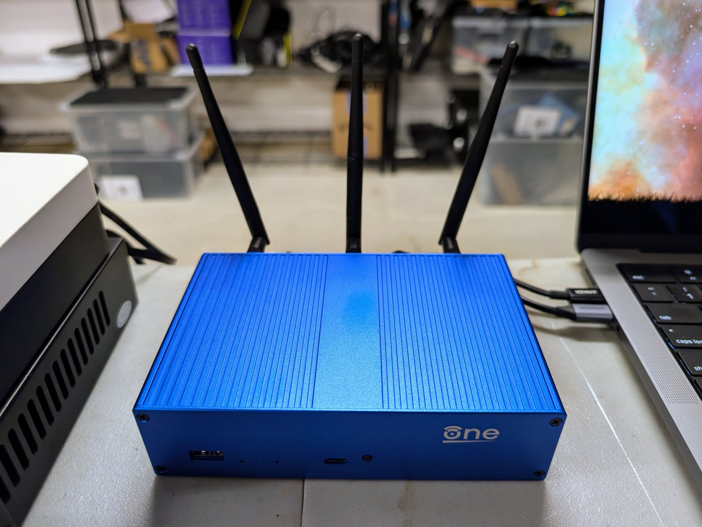

# Rung 5: the edge and the second site

**In plain terms.** Your network becomes yours. You decide which devices may talk to what, and
guests and smart-home gadgets get wifi networks of their own, away from your own machines. A
copy of the data that matters lives at a second place, such as a relative's house, so even
losing the whole house does not lose it.

**Status.** Built and tested on the bench, 20260928 and 20260929. The bench keeps double NAT by
Christoph's decision (below), so this page measures double NAT and describes the setup without
it.

## What you get

- **A router whose configuration lives in the repository:** applied from it, exported back to
  it every day, and an alert when the two differ.
- **DNS the site owns:** Technitium, authoritative for the site's names, on the core box
  ([rung 3](../3-core/)) as the primary and the infra box ([rung 1](../1-infra/)) as the
  secondary, with ad and tracker filtering, and every DHCP lease written into DNS as a name.
- **Three wifi networks: main, guest and IoT**, each kept apart by the router.
- **A second site** that receives an hourly, one-way, encrypted replica of the datasets that
  matter, with an alert when it falls behind, and a restore proven with the primary off.

**Buy.** A router you control, such as the OpenWrt One the bench has used since
[rung 0](../0-laptop/) ($145.99 on 20260928). If you already run one, this rung buys no
router. For the second site, a rescued box with its own drives ($300) or a second infra box
($2,540), at a place you trust.

**What still fails.** The switch and the UPS are still single, and every application still
runs on the one infra box. The second site holds a copy of the data, not a running copy of the
services.

**What comes next.** [Rung 6](../6-firewall/) puts a dedicated firewall at the edge, for a site
that wants the network itself to be as trustworthy as the boxes on it. This router then becomes
its wifi access point.

This rung is a branch. A site can take it before [rung 4](../4-compute/), or take the second
site before the edge.

## Decisions and options

**The router's configuration in the repository.** The repository holds one file per
configuration package (OpenWrt keeps its settings in packages such as `network`, `firewall` and
`dhcp`). An `apply` pushes them behind a rollback on the router, so a change that cuts the
router off reverts itself after two minutes. A daily export alerts on any difference. Settings
the site does not own, such as the provider's side, stay on the router and appear in the
repository only as a one-line marker saying what was left out. Secrets are placeholders filled
from the vault at apply time. Before the first apply, take the router's own backup
(`sysupgrade -b`) and keep it encrypted.
*Proof.* On 20260929 applying the repository changed nothing: the export was byte-identical
before and after. We then changed the router by hand, and the drift check caught the change,
alerted and reverted it. When one confirmation failed, the rollback reverted the router by
itself.

**DNS: Technitium, with AdGuard retired.** A full authoritative server holds the zone itself,
answers reverse lookups, and takes lease updates from the router.
- Two servers, on addresses of their own (the bench: `.15` on core, `.16` on infra). The old
  and new servers both answer during the migration, and the cut-over and the way back are each
  one DHCP setting.
- The one list of names in the repository becomes one zone. The secondary follows the primary
  by zone transfer. Pin the primary's outgoing address: if the primary has more than one
  address, the secondary refuses the notices the primary sends when the zone changes.
- Leases are written into a subzone (`lan.`) with a token that can change that subzone only.
- Run the migration as a copy. Old and new must answer every name the same, checked from two
  other machines, before DHCP hands out the new servers. Retire the old servers only after every
  check points at the new ones, and change the deployed checks first.
- Traps:
  - Technitium ships its own DHCP server, which must stay off.
  - A host cannot reach its own container on a macvlan network (Docker's mode that gives a
    container its own address on the LAN), so at this rung the infra box resolves through the
    router. [Rung 6](../6-firewall/) fixes this with Unraid's "Host access to custom networks".
  - When you add a name through Technitium's API with the PTR flag set, it replaces the
    reverse-lookup (PTR) record instead of adding one. On 15.5.1 a delete removes only that
    name's own PTR.
*Proof.* On 20260929 every site name, outside name and blocked name gave the same answer from
both servers before the cut-over. After it, the checks, the watcher (rung 2's scheduled check of
DNS, the backups and the web front door) and filtering passed. With everything on core stopped,
a name only the secondary held resolved in 14 ms.

**Double NAT, kept on the bench (Christoph's decision, 20260928).** Many homes run two routers
in a row that each translate addresses, and not always by choice. A provider's gateway that
cannot bridge, or a mesh system that loses its mesh in bridge mode, forces it.
- *What it costs, measured 20260929.* Both the bench and the second site sit behind "hard" NAT,
  where the public mapping changes per destination, and neither is offered port mapping. So
  every remote path runs through a Tailscale relay in Denver, at 31 to 45 ms, instead of a
  direct connection. No IPv6 reached the site. Remote access works, but it is slower, and
  inbound ports are impossible.
- *The options, in order.*
  1. Put the provider's gateway in bridge or passthrough mode where that costs you nothing
     else, so your router holds the public address and translates once.
  2. If you cannot, keep double NAT with a mesh VPN, as the bench does.
  3. On carrier-grade NAT, where the provider itself shares one public address among many
     customers (common with fiber and 5G providers), even bridge mode leaves translation
     upstream, and IPv6 is the way out.

**VLANs: none at this rung.** A site this size has one credible reason to segment: devices it
does not trust on the same wire as the boxes. The bench had none (guest and IoT are wifi only),
so it took no VLANs. Rung 6 needs them for the access point's link.

**Three wifi networks: main, guest and IoT.** We built and tested them on 20260928. On the bench
the radios are off between tests, with the configuration kept
([as built](../../as-built/site/router/wifi.md)).

| network | who joins it | may reach | may not reach |
|---|---|---|---|
| main (trusted) | your own laptops and phones | everything a wired box on the LAN may, including the site's services by name | nothing extra |
| guest | visitors | the internet | your LAN, the router's own services, IoT, other guests, the tailnet (your remote-access network) |
| IoT | smart-home devices: cameras, plugs, speakers, televisions | the internet | the same as guest; your own devices on main may open connections into IoT to control them, and IoT may open none back |

*Why.* Visitors' devices and smart-home gadgets are the least trusted things in a house; many
gadgets never get a security update. On networks of their own, a compromised camera or a
visitor's infected laptop cannot reach your servers, your files or each other.
- Guest and IoT are each a routed segment whose bridge holds only its wifi interface, so
  nothing on a wire changes. The router lets each reach only the internet, plus DHCP and DNS at
  its own address on that segment. It rejects every private range and the tailnet, so a guest
  gets a fast "refused". Clients on guest and IoT cannot see each other.
- Guest and IoT get a DNS server of their own on the router that knows none of the site's names.
- WPA2 and WPA3 mixed, so older devices still join.
*Would change it.* Many IoT devices speak only 2.4 GHz; add the IoT network on that radio when
you have one. Casting and hubs need client isolation off on IoT.
*Proof.* On 20260928 a mini PC joined each network in turn and ran 93 checks, and none failed
([as built](../../as-built/site/router/wifi.md)). We checked isolation between two guests only on
the access point's side.

**The second site: a replica, pulled, one-way.** The cloud bucket from rung 0 already survives
a house fire, but restoring a whole site from it is slow; the replica keeps a recent copy of
the datasets that matter within reach.
- *What it holds.* Documents, finance, photos, and the apps' data, which includes their nightly
  dumps and the forge. It does not hold bulk media.
- *How.* The infra box snapshots those four datasets every hour. The second site pulls them at a
  quarter past with syncoid, over the tailnet, the same way it would reach a relative's house.
  The pull uses a key that the infra box restricts to one command. That command is a guard: it
  allows only sending and holding snapshots of those datasets, and logs everything else as
  refused. We tried 21 hostile commands, and the guard refused all of them. The second site accepts no subnet routes, and a tailnet access
  policy lets it reach only the infra box's ssh.
- *Encrypted.* The replica lands in its own encrypted, read-only parent, so a stolen copy of the
  pool is unreadable. On the bench the key sits on the second site's disk, encrypted to its
  host key, which protects a stolen pool but not a stolen whole disk. *Would change it.* At a
  relative's house, keep the key off the box entirely and send it after each reboot; the
  replication then pauses until you do.
- *Watched.* An alert when the newest replica is more than two hours old.
- *One disk.* The bench's second site is a single virtual disk with no redundancy. A second site
  outside the bench should keep the replica on a drive of its own.
*Proof.* On 20260929, with the infra box powered off, the second site alone gave back the
documents (23 of 23 files identical by hash) and ran the forge from its replica, which showed
exactly the branches expected at the snapshot. The hourly pull has run unattended since
20260929.

## Costs and measurements

The Seed's design prices (US, checked 20260920; [costs](../../costs.md)) put this rung at $550
lean and $2,840 full. That covers the router (an OpenWrt One, $145.99 on 20260928), an access
point and the replica box, for a site that buys them; it leaves out an optional VLAN step, $250
to $400. Through rung 5 the total is $4,440 lean and $11,620 full.

Measured on the bench, 20260929:

| what | result |
|---|---|
| Remote access through double NAT | always relayed (Denver), 31 to 45 ms; no IPv6 from upstream |
| The replica's first full pull | about 230 MB at about 1.1 MB/s, through the relay |
| Each hourly pull after it | seconds |
| Restore with the primary off | passed: files by hash, and the forge from the replica |
| Infra power on to every container up | about 67 s |

The power-off test also found two faults. A newly added container that had been left off the
autostart list stayed down after the reboot. The infra box's ssh lost its tailnet address when
Unraid rebuilt its ssh settings at boot. The site's boot-time check now covers both.

## Runbooks

- The DNS cut-over and its way back:
  [`dns-cutover.md`](../../as-built/site/runbooks/dns-cutover.md).
- The second site, its restore test and its way back:
  [`site2.md`](../../as-built/site/runbooks/site2.md).
- The router's configuration: [`README.md`](../../as-built/site/router/README.md), with
  [`config-tool`](../../as-built/site/router/config-tool).

## Configuration

As built:
- the router: [`site/router/config/`](../../as-built/site/router/config/);
- DNS: [`site/dns/technitium/`](../../as-built/site/dns/technitium/) and the one list of names
  [`rewrites.yaml`](../../as-built/site/dns/rewrites.yaml); AdGuard's retired configuration in
  [`adguard-archive/`](../../as-built/site/dns/adguard-archive/);
- the second site: [`nixos/hosts/site2/`](../../as-built/nixos/hosts/site2/), the snapshot job
  [`replica-snap.sh`](../../as-built/site/infra/backup/replica-snap.sh) and the restricted key
  [`site2-authorized-key`](../../as-built/site/infra/backup/site2-authorized-key);
- the tailnet's access policy: [`acl.hujson`](../../as-built/site/tailnet/acl.hujson).
